# SovaBTC Yield System Deployment Orchestration Guide

This guide provides the **correct multi-stage deployment process** for the SovaBTC Yield System across multiple networks, solving the chicken-and-egg dependency problems.

## 🚨 **Critical Deployment Dependencies**

### **The Problem**
The original deployment script had critical architectural flaws:

1. **Circular Dependencies**: Vaults need BridgedSovaBTC addresses from other networks, but those tokens don't exist yet
2. **Single-Stage Assumption**: Assumed all dependencies exist before deployment
3. **Hardcoded Addresses**: Used mainnet token addresses even on testnets
4. **No Cross-Network Coordination**: Each network deployed independently

### **The Solution: Multi-Stage Deployment**

## 📋 **Deployment Stages Overview**

```mermaid
graph TB
    subgraph "Pre-Deployment"
        A[Deploy Mock Tokens on Testnets] --> B[Setup Hyperlane Infrastructure]
    end
    
    subgraph "Stage 1: Core System"
        C[Deploy on Sova Network] --> D[Deploy on Ethereum]
        D --> E[Deploy on Base]
        E --> F[Deploy on Other Networks]
    end
    
    subgraph "Stage 2: Cross-Network"
        G[Configure Ethereum ↔ Other Networks] --> H[Configure Base ↔ Other Networks]
        H --> I[Configure Sova ↔ All Networks]
    end
    
    subgraph "Stage 3: Verification"
        J[Test Cross-Network Bridging] --> K[Verify Asset Support]
        K --> L[Complete E2E Testing]
    end
    
    B --> C
    F --> G
    I --> J
```



## 🏗️ **Detailed Deployment Process**

### **Pre-Deployment: Infrastructure Setup**

#### 1. Deploy Mock Tokens (Testnets Only)
```bash
export NETWORK=sepolia  # or base-sepolia, arbitrum-sepolia

# Deploy mock tokens
forge script script/DeployMockTokens.s.sol --rpc-url $SEPOLIA_RPC_URL --broadcast

# Save addresses to .env.testnet
echo "MOCK_WBTC_SEPOLIA=0x..." >> .env.testnet
echo "MOCK_SOVA_SEPOLIA=0x..." >> .env.testnet
```

#### 2. Verify Hyperlane Infrastructure
```bash
# Check Hyperlane Mailbox deployments
cast call $HYPERLANE_MAILBOX_SEPOLIA "localDomain()" --rpc-url $SEPOLIA_RPC_URL
cast call $HYPERLANE_MAILBOX_BASE_SEPOLIA "localDomain()" --rpc-url $BASE_SEPOLIA_RPC_URL

# Ensure cross-chain message passing works
hyperlane send message --origin sepolia --destination basesepolia --key $PRIVATE_KEY
```

### **Stage 1: Core System Deployment**

Deploy core contracts on each network **independently** (no cross-network dependencies yet).

#### Network Deployment Order

1. **Sova Network** (Hub)
2. **Ethereum Mainnet** 
3. **Base Network**
4. **Additional Networks**

#### Stage 1 Commands

```bash
# 1. Deploy on Sova Network
export SOVA_CHAIN_ID=123456  # Actual Sova chain ID
forge script script/DeployStage1_Core.s.sol --rpc-url $SOVA_RPC_URL --broadcast

# 2. Deploy on Ethereum
forge script script/DeployStage1_Core.s.sol --rpc-url $ETHEREUM_RPC_URL --broadcast --verify

# 3. Deploy on Base
forge script script/DeployStage1_Core.s.sol --rpc-url $BASE_RPC_URL --broadcast --verify

# 4. Deploy on testnets
forge script script/DeployStage1_Core.s.sol --rpc-url $SEPOLIA_RPC_URL --broadcast --verify
forge script script/DeployStage1_Core.s.sol --rpc-url $BASE_SEPOLIA_RPC_URL --broadcast --verify
```

#### Stage 1 Output
Each deployment creates:
- `deployments/stage1-{chainId}.json` with contract addresses
- Core system contracts (vault, staking, bridge, redemption queue)
- **No cross-network configuration yet**

### **Stage 2: Cross-Network Configuration**

Configure each network to accept BridgedSovaBTC tokens from other networks as collateral.

#### Stage 2 Requirements
- **All Stage 1 deployments must be complete**
- **All deployment JSON files must exist**

#### Stage 2 Commands

```bash
# Configure cross-network support on each network
# (Run after ALL Stage 1 deployments are complete)

# Configure Ethereum to accept Base/Sova BridgedSovaBTC
forge script script/DeployStage2_CrossNetwork.s.sol --rpc-url $ETHEREUM_RPC_URL --broadcast

# Configure Base to accept Ethereum/Sova BridgedSovaBTC  
forge script script/DeployStage2_CrossNetwork.s.sol --rpc-url $BASE_RPC_URL --broadcast

# Configure Sova to accept all external BridgedSovaBTC
forge script script/DeployStage2_CrossNetwork.s.sol --rpc-url $SOVA_RPC_URL --broadcast

# Configure testnets
forge script script/DeployStage2_CrossNetwork.s.sol --rpc-url $SEPOLIA_RPC_URL --broadcast
forge script script/DeployStage2_CrossNetwork.s.sol --rpc-url $BASE_SEPOLIA_RPC_URL --broadcast
```

#### What Stage 2 Does

1. **Reads Stage 1 deployment files** from all networks
2. **Adds cross-network BridgedSovaBTC tokens** as supported vault assets
3. **Configures proper token recognition** across networks

Example: After Stage 2, Ethereum vault supports:
- Native WBTC, cbBTC, tBTC (primary assets)
- BridgedSovaBTC from Base Network
- BridgedSovaBTC from other networks

### **Stage 3: Verification & Testing**

#### Cross-Network Bridge Testing
```bash
# Test bridging from external network to Sova
cast send $BRIDGED_SOVABTC_ETHEREUM "bridgeToSova(address,uint256)" \
    $OWNER_ADDRESS 1000000000000000000 \
    --private-key $PRIVATE_KEY --rpc-url $ETHEREUM_RPC_URL

# Verify message received on Sova Network
# (Requires Sova Network RPC access)
```

#### Asset Support Verification
```bash
# Check supported assets on each vault
cast call $VAULT_ETHEREUM "getSupportedAssets()" --rpc-url $ETHEREUM_RPC_URL
cast call $VAULT_BASE "getSupportedAssets()" --rpc-url $BASE_RPC_URL
cast call $VAULT_SOVA "getSupportedAssets()" --rpc-url $SOVA_RPC_URL
```

#### End-to-End Testing
```bash
# Run comprehensive test suite
./scripts/comprehensive-test.sh

# Run cross-network tests
./scripts/cross-network-test.sh  # New script needed
```

## 🔧 **Deployment Scripts Reference**

### **New Multi-Stage Scripts**

| Script | Purpose | Dependencies |
|--------|---------|--------------|
| `DeployMockTokens.s.sol` | Deploy testnet mock tokens | None |
| `DeployStage1_Core.s.sol` | Core system deployment | Mock tokens (testnets) |
| `DeployStage2_CrossNetwork.s.sol` | Cross-network configuration | All Stage 1 complete |
| `DeployStage3_Verification.s.sol` | Testing and verification | All Stage 2 complete |

### **Legacy Script Issues**

❌ **`DeploySovaBTCYieldSystem.s.sol`** - **DO NOT USE**
- Single-stage deployment
- Circular dependencies
- Hardcoded addresses
- No cross-network support

## 📂 **Deployment Artifacts**

### **Directory Structure**
```
deployments/
├── stage1-1.json          # Ethereum mainnet
├── stage1-8453.json       # Base mainnet
├── stage1-123456.json     # Sova Network
├── stage1-11155111.json   # Sepolia testnet
├── stage1-84532.json      # Base Sepolia testnet
├── stage2-summary.json    # Cross-network configuration summary
└── mock-tokens/
    ├── sepolia.json       # Mock token addresses
    └── base-sepolia.json
```

### **Stage 1 JSON Format**
```json
{
  "stage": 1,
  "chainId": 1,
  "network": "Ethereum",
  "isSovaNetwork": false,
  "blockNumber": 12345678,
  "timestamp": "1640995200",
  "contracts": {
    "bridgedSovaBTC": "0x...",
    "yieldVault": "0x...",
    "yieldStaking": "0x...",
    "redemptionQueue": "0x..."
  }
}
```

## 🚨 **Critical Considerations**

### **1. Network Order Matters**
- **Deploy Sova Network first** (hub of hub-and-spoke model)
- **External networks can deploy in parallel** after Sova

### **2. Environment Variables**
```bash
# Required for all deployments
PRIVATE_KEY=0x...
OWNER_ADDRESS=0x...

# Network-specific
ETHEREUM_RPC_URL=https://...
BASE_RPC_URL=https://...
SOVA_RPC_URL=https://...

# Hyperlane Mailboxes (different per network)
HYPERLANE_MAILBOX_MAINNET=0x...
HYPERLANE_MAILBOX_BASE=0x...
HYPERLANE_MAILBOX_SOVA=0x...

# Mock tokens (testnets only)
MOCK_WBTC_SEPOLIA=0x...
MOCK_SOVA_SEPOLIA=0x...
```

### **3. Gas Considerations**
- **Stage 1**: ~2M gas per network (4 contracts)
- **Stage 2**: ~200K gas per network (configuration)
- **Total**: ~8-10M gas for full multi-network deployment

### **4. Security Validations**
After each stage:
```bash
# Verify ownership
cast call $VAULT_ADDRESS "owner()" --rpc-url $RPC_URL

# Verify access controls
cast call $BRIDGED_SOVABTC "hasRole(bytes32,address)" \
    $(cast keccak "VAULT_ROLE") $VAULT_ADDRESS --rpc-url $RPC_URL

# Verify cross-network asset support
cast call $VAULT_ADDRESS "isAssetSupported(address)" $CROSS_NETWORK_TOKEN --rpc-url $RPC_URL
```

## 🔄 **Deployment Automation**

### **Complete Deployment Script**
```bash
#!/bin/bash
# deploy-complete-system.sh

set -e

echo "🚀 Starting complete SovaBTC Yield System deployment"

# Stage 0: Pre-deployment
echo "📋 Stage 0: Pre-deployment setup"
forge script script/DeployMockTokens.s.sol --rpc-url $SEPOLIA_RPC_URL --broadcast
forge script script/DeployMockTokens.s.sol --rpc-url $BASE_SEPOLIA_RPC_URL --broadcast

# Stage 1: Core deployments
echo "🏗️ Stage 1: Core system deployment"
forge script script/DeployStage1_Core.s.sol --rpc-url $SOVA_RPC_URL --broadcast
forge script script/DeployStage1_Core.s.sol --rpc-url $ETHEREUM_RPC_URL --broadcast --verify
forge script script/DeployStage1_Core.s.sol --rpc-url $BASE_RPC_URL --broadcast --verify
forge script script/DeployStage1_Core.s.sol --rpc-url $SEPOLIA_RPC_URL --broadcast --verify
forge script script/DeployStage1_Core.s.sol --rpc-url $BASE_SEPOLIA_RPC_URL --broadcast --verify

# Stage 2: Cross-network configuration
echo "🔗 Stage 2: Cross-network configuration"
forge script script/DeployStage2_CrossNetwork.s.sol --rpc-url $ETHEREUM_RPC_URL --broadcast
forge script script/DeployStage2_CrossNetwork.s.sol --rpc-url $BASE_RPC_URL --broadcast
forge script script/DeployStage2_CrossNetwork.s.sol --rpc-url $SOVA_RPC_URL --broadcast
forge script script/DeployStage2_CrossNetwork.s.sol --rpc-url $SEPOLIA_RPC_URL --broadcast
forge script script/DeployStage2_CrossNetwork.s.sol --rpc-url $BASE_SEPOLIA_RPC_URL --broadcast

# Stage 3: Verification
echo "✅ Stage 3: System verification"
./scripts/comprehensive-test.sh
./scripts/cross-network-test.sh

echo "🎉 Complete system deployment successful!"
```

## 📚 **Additional Resources**

- **Hyperlane Documentation**: https://docs.hyperlane.xyz/
- **Multi-Chain Deployment Best Practices**: https://docs.openzeppelin.com/
- **Cross-Chain Security Considerations**: [Security Guide](./security.md)

## ⚠️ **Migration from Legacy Script**

If you've used the old `DeploySovaBTCYieldSystem.s.sol`:

1. **Don't use it for new deployments**
2. **For existing deployments**: Run Stage 2 script to add cross-network support
3. **Update your deployment pipelines** to use the new multi-stage process

This orchestrated deployment process ensures all dependencies are resolved correctly and all networks can support cross-network Bitcoin variants as collateral.