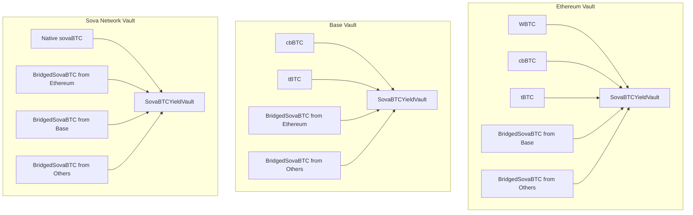

# Multi-Asset Collateral Support

> **Last Updated:** July 29, 2025

This document details how the SovaBTC Yield System supports multiple Bitcoin variants as collateral, including decimal normalization, cross-network asset recognition, and network-specific configurations.

## Table of Contents

- [Overview](#overview)
- [Supported Bitcoin Variants](#supported-bitcoin-variants)
- [Decimal Normalization](#decimal-normalization)
- [Cross-Network Asset Support](#cross-network-asset-support)
- [Network-Specific Configurations](#network-specific-configurations)
- [Asset Management](#asset-management)

## Overview

The SovaBTCYieldVault is designed as a **multi-asset yield vault** that can accept various Bitcoin-backed tokens as collateral on each network. This design maximizes capital efficiency and provides users with flexibility in their Bitcoin holdings while generating unified yield.

### Core Principles

1. **Unified Yield**: All Bitcoin variants generate yield in the same sovaBTC-denominated rewards
2. **Decimal Normalization**: Different decimal precision assets are normalized to 8 decimals
3. **Cross-Network Recognition**: BridgedSovaBTC from other networks accepted as collateral
4. **Network Optimization**: Each network supports the most relevant Bitcoin variants

## Supported Bitcoin Variants

### Primary Bitcoin Assets

| Asset | Symbol | Decimals | Networks | Description |
|-------|--------|----------|----------|-------------|
| **Wrapped Bitcoin** | WBTC | 8 | Ethereum | BitGo-custodied Bitcoin on Ethereum |
| **Coinbase Wrapped BTC** | cbBTC | 8 | Ethereum, Base | Coinbase-custodied Bitcoin |
| **Threshold Bitcoin** | tBTC | 18 | Ethereum, Base, Arbitrum | Decentralized Bitcoin bridge |
| **Native sovaBTC** | sovaBTC | 8 | Sova Network | Native Bitcoin on Sova Network |

### Cross-Network Assets

| Asset | Symbol | Decimals | Description |
|-------|--------|----------|-------------|
| **BridgedSovaBTC** | sovaBTC | 8 | External Networks | Cross-chain sovaBTC via Hyperlane |

## Decimal Normalization

### The Challenge

Bitcoin variants use different decimal precisions:
- **8 decimals**: WBTC, cbBTC, sovaBTC (traditional Bitcoin precision)
- **18 decimals**: tBTC (Ethereum standard)

### Normalization Process

All assets are normalized to **8 decimals** (Bitcoin standard) for consistent yield calculations:

```solidity
function _normalizeAmount(address token, uint256 amount) internal view returns (uint256) {
    uint8 tokenDecimals = IERC20Metadata(token).decimals();
    
    if (tokenDecimals == 8) {
        return amount; // Already normalized
    } else if (tokenDecimals > 8) {
        // Scale down (e.g., 18 → 8 decimals)
        return amount / (10 ** (tokenDecimals - 8));
    } else {
        // Scale up (e.g., 6 → 8 decimals)
        return amount * (10 ** (8 - tokenDecimals));
    }
}
```

### Examples

```solidity
// tBTC (18 decimals): 1.5 tBTC = 1,500,000,000,000,000,000 wei
// Normalized: 150,000,000 (8 decimals)

// WBTC (8 decimals): 1.5 WBTC = 150,000,000 satoshi
// Normalized: 150,000,000 (no change)

// Hypothetical 6-decimal asset: 1.5 BTC = 1,500,000 units
// Normalized: 150,000,000 (scaled up)
```

## Cross-Network Asset Support

### Hub-and-Spoke Model

The system employs a hub-and-spoke architecture where each network's vault can accept:

1. **Primary Assets**: Native Bitcoin variants on that network
2. **Cross-Network Assets**: BridgedSovaBTC tokens from other networks



### Cross-Network Configuration

Cross-network asset support is configured during Stage 2 deployment:

```solidity
// Example: Adding Base's BridgedSovaBTC to Ethereum vault
vault.addSupportedAsset(
    0x..., // Base BridgedSovaBTC address
    "BridgedSovaBTC from Base Network"
);
```

## Network-Specific Configurations

### Ethereum Mainnet

**Primary Assets:**
- WBTC (0x2260FAC5E5542a773Aa44fBCfeDf7C193bc2C599)
- cbBTC (0xcbB7C0000aB88B473b1f5aFd9ef808440eed33Bf)
- tBTC (0x18084fbA666a33d37592fA2633fD49a74DD93a88)

**Cross-Network Assets:**
- BridgedSovaBTC from Base, Arbitrum, and other supported networks

**Configuration Example:**
```solidity
// Add primary assets
vault.addSupportedAsset(WBTC_ADDRESS, "Wrapped Bitcoin");
vault.addSupportedAsset(CBBTC_ADDRESS, "Coinbase Wrapped BTC");
vault.addSupportedAsset(TBTC_ADDRESS, "Threshold Bitcoin");

// Add cross-network assets (Stage 2)
vault.addSupportedAsset(BASE_BRIDGED_SOVABTC, "BridgedSovaBTC from Base");
```

### Base Network

**Primary Assets:**
- cbBTC (0xcbB7C0000aB88B473b1f5aFd9ef808440eed33Bf)
- tBTC (0x236aa50979D5f3De3Bd1Eeb40E81137F22ab794b)

**Cross-Network Assets:**
- BridgedSovaBTC from Ethereum, Arbitrum, and other supported networks

**Rationale**: Base network focuses on Coinbase ecosystem (cbBTC) and decentralized options (tBTC)

### Sova Network

**Primary Assets:**
- Native sovaBTC (0x2100000000000000000000000000000000000020)

**Cross-Network Assets:**
- BridgedSovaBTC from all external networks (Ethereum, Base, Arbitrum, etc.)

**Special Configuration**: Sova Network acts as the hub and can accept sovaBTC from any external network

### Testnet Configurations

**Mock Assets**: Testnets use mock versions of all tokens deployed via `DeployMockTokens.s.sol`

| Network | Mock WBTC | Mock cbBTC | Mock tBTC | Mock SOVA |
|---------|-----------|------------|-----------|-----------|
| **Sepolia** | ✅ | ✅ | ✅ | ✅ |
| **Base Sepolia** | ✅ | ✅ | ✅ | ✅ |
| **Arbitrum Sepolia** | ✅ | ✅ | ✅ | ✅ |

## Asset Management

### Adding New Assets

Only the vault owner can add new supported assets:

```solidity
function addSupportedAsset(address asset, string memory name) external onlyOwner {
    require(asset != address(0), "Zero address");
    require(!supportedAssets[asset], "Asset already supported");
    
    supportedAssets[asset] = true;
    supportedAssetsList.push(asset);
    
    emit AssetAdded(asset, name);
}
```

### Removing Assets

Assets can be removed if no longer desired:

```solidity
function removeSupportedAsset(address asset) external onlyOwner {
    require(supportedAssets[asset], "Asset not supported");
    
    supportedAssets[asset] = false;
    
    // Remove from array (gas-intensive operation)
    for (uint256 i = 0; i < supportedAssetsList.length; i++) {
        if (supportedAssetsList[i] == asset) {
            supportedAssetsList[i] = supportedAssetsList[supportedAssetsList.length - 1];
            supportedAssetsList.pop();
            break;
        }
    }
    
    emit AssetRemoved(asset);
}
```

### Asset Validation

Before accepting deposits, the system validates:

1. **Asset Support**: Is the asset in the supported assets list?
2. **Decimal Compatibility**: Can the asset be normalized to 8 decimals?
3. **Transfer Capability**: Does the asset implement proper ERC-20 functions?

```solidity
function depositAsset(address asset, uint256 amount, address receiver) external returns (uint256 shares) {
    require(supportedAssets[asset], "Asset not supported");
    require(amount > 0, "Zero amount");
    require(receiver != address(0), "Zero address");
    
    // Transfer asset to vault
    IERC20(asset).safeTransferFrom(msg.sender, address(this), amount);
    
    // Normalize amount to 8 decimals
    uint256 normalizedAmount = _normalizeAmount(asset, amount);
    
    // Calculate shares to mint
    if (totalSupply() == 0) {
        shares = normalizedAmount;
    } else {
        shares = convertToShares(normalizedAmount);
    }
    
    // Mint vault shares
    _mint(receiver, shares);
    
    emit Deposit(msg.sender, receiver, normalizedAmount, shares);
}
```

## Use Cases and Examples

### 1. Multi-Asset Portfolio Deposit

A user wants to deposit their entire Bitcoin portfolio:

```solidity
// User has: 2 WBTC, 1.5 cbBTC, 3 tBTC
// All get normalized and combined into unified yield position

vault.depositAsset(WBTC, 200000000, user);      // 2 WBTC (8 decimals)
vault.depositAsset(CBBTC, 150000000, user);     // 1.5 cbBTC (8 decimals)  
vault.depositAsset(TBTC, 3000000000000000000, user); // 3 tBTC (18 decimals → normalized to 8)

// User receives vault shares representing ~6.5 BTC worth of assets
```

### 2. Cross-Network Arbitrage

A user bridges sovaBTC from Sova Network to Ethereum and deposits:

```solidity
// Step 1: Bridge sovaBTC from Sova to Ethereum (via Hyperlane)
// Step 2: Deposit bridged sovaBTC into Ethereum vault
vault.depositAsset(BRIDGED_SOVABTC_FROM_SOVA, amount, user);

// Now earning yield on Ethereum while holding sovaBTC
```

### 3. Yield Optimization

A user compares yield rates across networks and moves assets:

```solidity
// Check yield rates
uint256 ethereumAPY = ethereumVault.getCurrentExchangeRate();
uint256 baseAPY = baseVault.getCurrentExchangeRate();

// If Base has higher yields:
// 1. Redeem from Ethereum vault
// 2. Bridge assets to Base
// 3. Deposit into Base vault
```

## Integration Considerations

### For DeFi Protocols

When integrating with the vault:

```solidity
// Check if asset is supported before attempting deposits
require(vault.isAssetSupported(asset), "Asset not supported");

// Get normalized amount for calculations
uint256 normalizedAmount = vault.previewDeposit(amount);

// Deposit and receive shares
uint256 shares = vault.depositAsset(asset, amount, receiver);
```

### For Frontend Applications

Display all supported assets:

```solidity
address[] memory assets = vault.getSupportedAssets();
for (uint256 i = 0; i < assets.length; i++) {
    string memory symbol = IERC20Metadata(assets[i]).symbol();
    uint8 decimals = IERC20Metadata(assets[i]).decimals();
    // Display in UI with proper decimal handling
}
```

## Security Considerations

### Asset Validation

1. **Whitelist Only**: Only pre-approved assets can be deposited
2. **Decimal Limits**: System supports 1-18 decimal assets with 8-decimal normalization
3. **Transfer Validation**: All transfers validated before processing
4. **Zero Amount Protection**: Prevents dust attacks and zero-amount deposits

### Cross-Network Risks

1. **Bridge Security**: Cross-network assets depend on Hyperlane bridge security
2. **Asset Consistency**: Same asset across networks must maintain value parity
3. **Liquidity Fragmentation**: Assets spread across networks may impact liquidity

### Mitigation Strategies

1. **Conservative Asset Addition**: Thorough vetting before adding new assets
2. **Monitoring**: Real-time monitoring of cross-network asset values
3. **Emergency Controls**: Ability to pause deposits for specific assets
4. **Gradual Rollout**: New assets added with initial deposit limits

For deployment procedures including asset configuration, see the [Deployment Orchestration Guide](./deployment-orchestration.md).