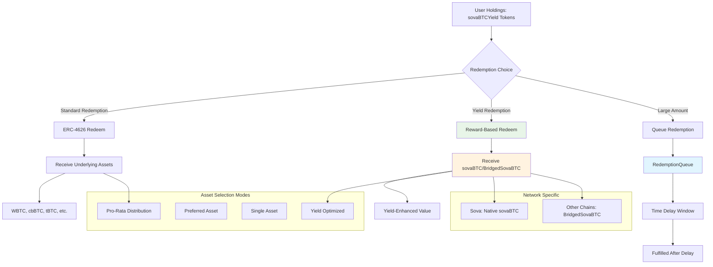

# Redemption System

> **Last Updated:** July 30, 2025

This document details the redemption mechanisms in the SovaBTC Yield System, including standard ERC-4626 redemptions, yield-optimized redemptions, and the simple time-based queue system.

## Table of Contents

- [Overview](#overview)
- [Redemption Architecture](#redemption-architecture)
- [Redemption Types](#redemption-types)
- [Time-Based Redemption Queue](#time-based-redemption-queue)
- [Redemption Configuration](#redemption-configuration)
- [Network-Specific Behavior](#network-specific-behavior)
- [Security Considerations](#security-considerations)

## Overview

The SovaBTC Yield System provides **flexible redemption mechanisms** that allow users to exit their positions in multiple ways, each optimized for different use cases. The system supports both **standard ERC-4626 redemptions** for underlying assets and **yield-optimized redemptions** for sovaBTC rewards.

### Core Redemption Features

1. **Standard ERC-4626 Redemption**: Exchange vault shares for underlying Bitcoin assets
2. **Yield-Optimized Redemption**: Exchange vault shares for sovaBTC rewards at enhanced rates
3. **Simple Time-Based Queue**: Process redemptions after a time delay
4. **Multi-Asset Distribution**: Flexible asset allocation during redemption

## Redemption Architecture



## Redemption Types

### 1. Standard ERC-4626 Redemption

**Purpose**: Exchange vault shares for underlying Bitcoin assets

**Implementation**:
```solidity
function redeem(uint256 shares, address receiver, address owner) 
    external 
    returns (uint256 assets) 
{
    // Validate redemption
    require(shares > 0, "Zero shares");
    require(receiver != address(0), "Zero address");
    
    // Check allowance if not owner
    if (msg.sender != owner) {
        uint256 allowed = allowance(owner, msg.sender);
        require(allowed >= shares, "Insufficient allowance");
        _approve(owner, msg.sender, allowed - shares);
    }
    
    // Calculate asset amount
    assets = convertToAssets(shares);
    require(assets > 0, "Zero assets");
    
    // Burn shares
    _burn(owner, shares);
    
    // Distribute underlying assets
    _distributeUnderlyingAssets(receiver, assets);
    
    emit Withdraw(msg.sender, receiver, owner, assets, shares);
}
```

**Asset Distribution Logic**:
```solidity
function _distributeUnderlyingAssets(address receiver, uint256 totalAssets) internal {
    // Get available asset balances
    uint256 totalAvailable = 0;
    uint256[] memory balances = new uint256[](supportedAssetsList.length);
    
    for (uint256 i = 0; i < supportedAssetsList.length; i++) {
        address asset = supportedAssetsList[i];
        balances[i] = IERC20(asset).balanceOf(address(this));
        totalAvailable += _normalizeAmount(asset, balances[i]);
    }
    
    // Distribute pro-rata based on availability
    for (uint256 i = 0; i < supportedAssetsList.length; i++) {
        if (balances[i] > 0) {
            address asset = supportedAssetsList[i];
            uint256 normalizedBalance = _normalizeAmount(asset, balances[i]);
            uint256 shareOfTotal = normalizedBalance * totalAssets / totalAvailable;
            
            // Convert back to asset decimals and transfer
            uint256 assetAmount = _denormalizeAmount(asset, shareOfTotal);
            if (assetAmount > 0) {
                IERC20(asset).safeTransfer(receiver, assetAmount);
            }
        }
    }
}
```

### 2. Yield-Optimized Redemption

**Purpose**: Exchange vault shares for sovaBTC rewards at enhanced exchange rate

**Implementation**:
```solidity
function redeemForRewards(uint256 shares, address receiver) 
    external 
    returns (uint256 rewardAmount) 
{
    require(shares > 0, "Zero shares");
    require(receiver != address(0), "Zero address");
    require(balanceOf(msg.sender) >= shares, "Insufficient balance");
    
    // Calculate reward amount using exchange rate
    rewardAmount = shares * exchangeRate / EXCHANGE_RATE_PRECISION;
    require(rewardAmount > 0, "Zero rewards");
    
    // Check reward token availability
    require(rewardToken.balanceOf(address(this)) >= rewardAmount, "Insufficient rewards");
    
    // Burn vault shares
    _burn(msg.sender, shares);
    
    // Transfer reward tokens
    rewardToken.safeTransfer(receiver, rewardAmount);
    
    emit RewardTokensRedeemed(msg.sender, shares, rewardAmount);
}
```

**Exchange Rate Mechanism**:
```solidity
// Exchange rate increases as yield is added to the vault
// Initial rate: 1:1 (1e18 precision)
// After yield: rate = (totalAssets + accumulatedYield) / totalShares
function updateExchangeRate(uint256 yieldAdded) internal {
    if (totalSupply() > 0) {
        uint256 newTotalValue = totalAssets() + yieldAdded;
        exchangeRate = newTotalValue * EXCHANGE_RATE_PRECISION / totalSupply();
    }
}
```

## Time-Based Redemption Queue

The RedemptionQueue contract provides a simple time-based redemption system where users request redemptions that can be fulfilled after a configurable time delay.

### Queue Configuration

```solidity
struct QueueConfig {
    uint256 windowDuration;          // Time delay before fulfillment (e.g., 24 hours)
    bool enabled;                    // Whether queue is enabled
}
```

### Redemption Request Process

```solidity
function requestQueuedRedemption(uint256 shares, address receiver) 
    external returns (bytes32 requestId) 
{
    require(shares >= minRedemptionAmount, "Below minimum");
    require(balanceOf(msg.sender) >= shares, "Insufficient balance");
    
    // Add to redemption queue
    requestId = redemptionQueue.requestRedemption(
        msg.sender,
        RedemptionQueue.RedemptionType.VaultShares,
        shares,
        address(0), // Any asset
        convertToAssets(shares)
    );
    
    // Lock shares by transferring to queue contract
    _transfer(msg.sender, address(redemptionQueue), shares);
    
    emit QueuedRedemptionRequested(msg.sender, requestId, shares);
}
```

### Queue Processing

```solidity
function fulfillQueuedRedemption(bytes32 requestId) external {
    // The redemption queue will validate timing and call back to the vault
    redemptionQueue.fulfillRedemption(requestId, actualAmountOut);
}
```

### Time-Based Processing

```solidity
function _canFulfillRequest(bytes32 requestId) internal view returns (bool) {
    RedemptionRequest memory request = redemptionRequests[requestId];
    return block.timestamp >= request.fulfillmentTime &&
           request.status == RedemptionStatus.PENDING;
}
```

## Redemption Configuration

### Admin Controls

```solidity
function setRedemptionConfig(
    uint256 _minRedemptionAmount,
    uint256 _redemptionFee,
    address _preferredAsset
) external onlyOwner {
    require(_redemptionFee <= MAX_REDEMPTION_FEE, "Fee too high"); // Max 2%
    require(_preferredAsset == address(0) || supportedAssets[_preferredAsset], "Invalid asset");
    
    minRedemptionAmount = _minRedemptionAmount;
    redemptionFee = _redemptionFee;
    preferredRedemptionAsset = _preferredAsset;
    
    emit RedemptionConfigUpdated(_minRedemptionAmount, _redemptionFee, _preferredAsset);
}
```

### Redemption Modes

```solidity
enum RedemptionMode {
    ProRata,        // Distribute across all available assets proportionally
    PreferredAsset, // Try preferred asset first, fallback to pro-rata
    SingleAsset,    // Redeem in single specified asset (if available)
    YieldOptimized  // Redeem for sovaBTC rewards using exchange rate
}

function setDefaultRedemptionMode(RedemptionMode mode) external onlyOwner {
    defaultRedemptionMode = mode;
    emit RedemptionModeUpdated(mode);
}
```

### Advanced Redemption Options

```solidity
function redeemWithPreference(
    uint256 shares,
    address receiver,
    address preferredAsset,
    RedemptionMode mode
) external returns (uint256[] memory amounts) {
    require(shares >= minRedemptionAmount, "Below minimum");
    require(supportedAssets[preferredAsset] || preferredAsset == address(0), "Invalid asset");
    
    // Calculate total asset value
    uint256 totalAssetValue = convertToAssets(shares);
    
    // Apply redemption fee if configured
    if (redemptionFee > 0) {
        uint256 fee = totalAssetValue * redemptionFee / 10000;
        totalAssetValue -= fee;
        // Fee stays in vault to benefit remaining holders
    }
    
    // Execute redemption based on mode
    amounts = _executeRedemption(receiver, totalAssetValue, preferredAsset, mode);
    
    // Burn shares after successful redemption
    _burn(msg.sender, shares);
    
    emit RedemptionExecuted(msg.sender, receiver, shares, amounts, mode);
}
```

The simplified queue system processes redemptions individually after the time delay has passed, without complex batching or windowing logic.

## Network-Specific Behavior

### Network-Specific Queue Configuration

```solidity
// Ethereum: 24 hour delay for security
QueueConfig memory ethConfig = QueueConfig({
    windowDuration: 24 hours,
    enabled: true
});

// Base: 12 hour delay for faster processing
QueueConfig memory baseConfig = QueueConfig({
    windowDuration: 12 hours,
    enabled: true
});

// Sova: 6 hour delay for native network
QueueConfig memory sovaConfig = QueueConfig({
    windowDuration: 6 hours,
    enabled: true
});
```


## Security Considerations

### Redemption Security Features

1. **Time Delays**: Prevent flash loan attacks and provide security buffer
2. **Simple Queue System**: Time-based queue prevents complex attack vectors
3. **Access Controls**: Only authorized processors can fulfill requests
4. **Cancellation Rights**: Users can cancel pending requests

### Risk Mitigation

1. **Simple Design**: Reduced complexity minimizes attack surface
2. **Time-Based Processing**: Natural rate limiting through time delays
3. **User Control**: Users maintain control over their redemption requests
4. **Owner Controls**: Emergency pause and configuration updates

For integration examples and technical implementation details, see the [Integration Guide](./integration.md) and [System Architecture](./system-architecture.md) documentation.