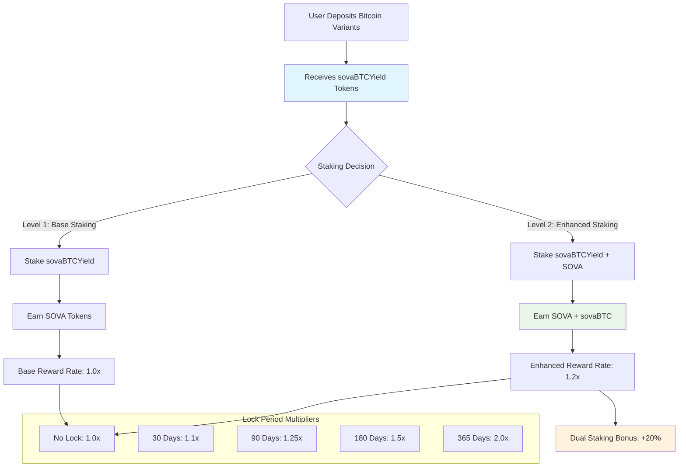

# Rewards & Staking System

> **Last Updated:** July 29, 2025

This document details the sophisticated dual token staking mechanism in the SovaBTC Yield System, including reward calculations, lock periods, and advanced staking features.

## Table of Contents

- [Overview](#overview)
- [Dual Token Staking Architecture](#dual-token-staking-architecture)
- [Staking Mechanics](#staking-mechanics)
- [Lock Period & Reward Multipliers](#lock-period--reward-multipliers)
- [Reward Rate Configuration](#reward-rate-configuration)
- [Reward Pool Management](#reward-pool-management)
- [Advanced Staking Features](#advanced-staking-features)
- [Network-Specific Configurations](#network-specific-configurations)
- [Performance Optimization](#performance-optimization)

## Overview

The SovaBTC Yield System features a sophisticated **dual token staking mechanism** that creates symbiotic relationships between vault participation and governance token staking. This design incentivizes long-term commitment while providing multiple layers of rewards.

### Core Concepts

1. **Level 1 Staking**: Stake sovaBTCYield tokens → Earn SOVA tokens
2. **Level 2 Staking**: Stake SOVA + maintain sovaBTCYield stake → Earn sovaBTC rewards
3. **Lock Period Multipliers**: 1.0x to 2.0x based on commitment duration
4. **Dual Staking Bonus**: +20% rewards for participating in both levels

## Dual Token Staking Architecture



## Staking Mechanics

### Level 1 Staking: sovaBTCYield → SOVA

**Requirements**: Only sovaBTCYield tokens staked

**Implementation**:
```solidity
function stakeVaultTokens(uint256 amount, uint256 lockPeriod) external {
    require(amount > 0, "Zero amount");
    require(isValidLockPeriod(lockPeriod), "Invalid lock period");
    
    // Transfer vault tokens to staking contract
    vaultToken.safeTransferFrom(msg.sender, address(this), amount);
    
    // Update user stake
    UserStake storage userStake = userStakes[msg.sender];
    userStake.vaultTokenAmount += amount;
    userStake.lockEndTime = block.timestamp + lockPeriod;
    userStake.lastRewardUpdate = block.timestamp;
    
    emit VaultTokensStaked(msg.sender, amount, lockPeriod);
}
```

**Reward Calculation**:
```solidity
// SOVA rewards = staked_amount × rate × time × lock_multiplier
sovaRewards = vaultTokenAmount × vaultToSovaRate × timeStaked × lockMultiplier / 10000;
```

### Level 2 Staking: SOVA + sovaBTCYield → Enhanced Rewards

**Requirements**: Must have sovaBTCYield tokens staked + additional SOVA staking

**Implementation**:
```solidity
function stakeSova(uint256 amount, uint256 lockPeriod) external {
    UserStake storage userStake = userStakes[msg.sender];
    require(userStake.vaultTokenAmount > 0, "Must stake vault tokens first");
    require(amount > 0, "Zero amount");
    
    // Transfer SOVA tokens to staking contract
    sovaToken.safeTransferFrom(msg.sender, address(this), amount);
    
    // Update user stake
    userStake.sovaAmount += amount;
    userStake.lockEndTime = block.timestamp + lockPeriod;
    
    emit SovaStaked(msg.sender, amount, lockPeriod);
}
```

**Enhanced Reward Calculation**:
```solidity
// Dual staking provides both SOVA and sovaBTC rewards with bonus
sovaRewards = vaultTokenAmount × vaultToSovaRate × timeStaked × lockMultiplier × dualBonus / 10000;
sovaBTCRewards = sovaAmount × sovaToSovaBTCRate × timeStaked × lockMultiplier / 10000;
```

## Lock Period & Reward Multipliers

### Lock Period Configuration

| Lock Duration | Multiplier | APY Boost | Use Case |
|---------------|------------|-----------|----------|
| **No Lock (0 days)** | 1.0x | Baseline | Flexible liquidity |
| **30 Days** | 1.1x | +10% | Short-term commitment |
| **90 Days** | 1.25x | +25% | Medium-term planning |
| **180 Days** | 1.5x | +50% | Long-term strategy |
| **365 Days** | 2.0x | +100% | Maximum commitment |

### Admin Configuration

```solidity
function setLockMultipliers(uint256[] memory lockPeriods, uint256[] memory multipliers) 
    external onlyOwner 
{
    require(lockPeriods.length == multipliers.length, "Array length mismatch");
    
    for (uint256 i = 0; i < lockPeriods.length; i++) {
        require(multipliers[i] >= 1000, "Multiplier too low"); // Minimum 1.0x
        require(multipliers[i] <= 5000, "Multiplier too high"); // Maximum 5.0x
        lockMultipliers[lockPeriods[i]] = multipliers[i];
    }
}
```

## Reward Rate Configuration

### Administrative Controls

```solidity
function setRewardRates(
    uint256 _vaultToSovaRate,
    uint256 _sovaToSovaBTCRate, 
    uint256 _dualStakeMultiplier
) external onlyOwner {
    require(_dualStakeMultiplier >= 10000, "Bonus cannot be negative");
    require(_dualStakeMultiplier <= 50000, "Bonus too high (max 500%)");
    
    vaultToSovaRate = _vaultToSovaRate;
    sovaToSovaBTCRate = _sovaToSovaBTCRate;
    dualStakeMultiplier = _dualStakeMultiplier;
    
    emit RewardRatesUpdated(_vaultToSovaRate, _sovaToSovaBTCRate, _dualStakeMultiplier);
}
```

### Example Rate Calculations

**Typical Configuration**:
```solidity
// Example reward rates (per second, per token)
vaultToSovaRate = 1e15;        // ~3.15% APY base rate
sovaToSovaBTCRate = 5e14;      // ~1.58% APY for sovaBTC rewards
dualStakeMultiplier = 12000;   // 20% bonus for dual staking
```

**APY Calculation Example**:
```javascript
// For 1 sovaBTCYield token staked for 1 year with 365-day lock
const baseReward = 1 * 1e15 * 31536000; // 1 token × rate × seconds per year
const lockMultiplier = 2.0; // 365-day lock = 2.0x
const dualBonus = 1.2; // 20% bonus for dual staking
const finalAPY = baseReward * lockMultiplier * dualBonus / 1e18 * 100;
// Result: ~7.56% APY for maximum commitment dual staking
```

## Reward Pool Management

### Funding the Reward System

```solidity
function addRewards(uint256 sovaAmount, uint256 sovaBTCAmount) external onlyOwner {
    if (sovaAmount > 0) {
        sovaToken.safeTransferFrom(msg.sender, address(this), sovaAmount);
        totalSovaRewards += sovaAmount;
    }
    
    if (sovaBTCAmount > 0) {
        rewardToken.safeTransferFrom(msg.sender, address(this), sovaBTCAmount);
        totalSovaBTCRewards += sovaBTCAmount;
    }
    
    emit RewardsAdded(sovaAmount, sovaBTCAmount);
}
```

### Reward Pool Analytics

```solidity
function getRewardPoolStatus() external view returns (
    uint256 sovaReserves,
    uint256 sovaBTCReserves,
    uint256 totalSovaDistributed,
    uint256 totalSovaBTCDistributed,
    uint256 estimatedDaysRemaining
) {
    sovaReserves = sovaToken.balanceOf(address(this)) - totalSovaStaked;
    sovaBTCReserves = rewardToken.balanceOf(address(this));
    totalSovaDistributed = totalSovaRewards - sovaReserves;
    totalSovaBTCDistributed = totalSovaBTCRewards - sovaBTCReserves;
    
    // Estimate days remaining at current reward rate
    uint256 currentDailyDistribution = getCurrentDailyRewardRate();
    if (currentDailyDistribution > 0) {
        estimatedDaysRemaining = sovaReserves / currentDailyDistribution;
    }
}
```

## Advanced Staking Features

### 1. Compound Staking

```solidity
function compoundSovaRewards() external {
    (uint256 sovaRewards,) = getPendingRewards(msg.sender);
    require(sovaRewards > 0, "No rewards to compound");
    
    // Claim SOVA rewards
    _claimSovaRewards(msg.sender);
    
    // Automatically stake claimed SOVA
    UserStake storage userStake = userStakes[msg.sender];
    userStake.sovaAmount += sovaRewards;
    
    emit RewardsCompounded(msg.sender, sovaRewards);
}
```

### 2. Emergency Unstaking

```solidity
function emergencyUnstake() external {
    UserStake storage userStake = userStakes[msg.sender];
    require(userStake.vaultTokenAmount > 0 || userStake.sovaAmount > 0, "No stake");
    
    // Calculate penalties
    uint256 vaultPenalty = userStake.vaultTokenAmount * VAULT_EMERGENCY_PENALTY / 10000; // 10%
    uint256 sovaPenalty = userStake.sovaAmount * SOVA_EMERGENCY_PENALTY / 10000; // 20%
    
    // Return tokens minus penalties
    if (userStake.vaultTokenAmount > 0) {
        uint256 returnAmount = userStake.vaultTokenAmount - vaultPenalty;
        vaultToken.safeTransfer(msg.sender, returnAmount);
    }
    
    if (userStake.sovaAmount > 0) {
        uint256 returnAmount = userStake.sovaAmount - sovaPenalty;
        sovaToken.safeTransfer(msg.sender, returnAmount);
    }
    
    // Forfeit all pending rewards
    delete userStakes[msg.sender];
    
    emit EmergencyUnstake(msg.sender, vaultPenalty, sovaPenalty);
}
```

### 3. Queue-Based Reward Redemption

For enhanced liquidity management, rewards can be redeemed through the queue system:

```solidity
function requestQueuedRewardRedemption(uint256 amount, address receiver) 
    external returns (bytes32 requestId) 
{
    require(amount > 0, "Zero amount");
    require(receiver != address(0), "Zero address");
    
    // Check pending rewards
    (uint256 sovaRewards, uint256 sovaBTCRewards) = getPendingRewards(msg.sender);
    require(sovaRewards >= amount || sovaBTCRewards >= amount, "Insufficient rewards");
    
    // Request redemption through queue
    requestId = redemptionQueue.requestRedemption(
        msg.sender,
        RedemptionQueue.RedemptionType.StakingRewards,
        amount,
        address(rewardToken), // Prefer sovaBTC rewards
        amount // 1:1 estimated output
    );
    
    emit QueuedRewardRedemptionRequested(msg.sender, requestId, amount);
}
```

### 4. Staking Analytics & Insights

```solidity
function getStakingDetails(address user) external view returns (
    uint256 vaultTokensStaked,
    uint256 sovaTokensStaked,
    uint256 lockEndTime,
    uint256 currentMultiplier,
    uint256 pendingSovaRewards,
    uint256 pendingSovaBTCRewards,
    uint256 estimatedDailyRewards,
    bool isDualStaking
) {
    UserStake memory userStake = userStakes[user];
    
    vaultTokensStaked = userStake.vaultTokenAmount;
    sovaTokensStaked = userStake.sovaAmount;
    lockEndTime = userStake.lockEndTime;
    currentMultiplier = _getLockMultiplier(userStake.lockEndTime - block.timestamp);
    
    (pendingSovaRewards, pendingSovaBTCRewards) = getPendingRewards(user);
    
    isDualStaking = vaultTokensStaked > 0 && sovaTokensStaked > 0;
    
    // Calculate estimated daily rewards
    estimatedDailyRewards = _calculateDailyRewards(user);
}
```

## Network-Specific Configurations

### Ethereum Mainnet
- **SOVA Rate**: 1e15 per second (~3.15% base APY)
- **sovaBTC Rate**: 5e14 per second (~1.58% base APY)  
- **Dual Bonus**: 20% (12000 basis points)
- **Max Lock Multiplier**: 2.0x (365 days)

### Base Network
- **SOVA Rate**: 1.2e15 per second (~3.78% base APY)
- **sovaBTC Rate**: 6e14 per second (~1.89% base APY)
- **Dual Bonus**: 25% (12500 basis points)
- **Max Lock Multiplier**: 2.0x (365 days)

### Sova Network
- **SOVA Rate**: 8e14 per second (~2.52% base APY)
- **sovaBTC Rate**: 1e15 per second (~3.15% base APY)
- **Dual Bonus**: 30% (13000 basis points)
- **Max Lock Multiplier**: 2.5x (365 days)

## Performance Optimization

### Gas-Efficient Reward Claims

```solidity
function batchClaimRewards(address[] calldata users) external onlyOwner {
    for (uint256 i = 0; i < users.length; i++) {
        if (userStakes[users[i]].vaultTokenAmount > 0) {
            _claimRewards(users[i]);
        }
    }
}

modifier autoCompound() {
    if (shouldAutoCompound(msg.sender)) {
        _compoundRewards(msg.sender);
    }
    _;
}
```

### Reward Distribution Optimization

```solidity
function updateRewardsForUsers(address[] calldata users) external {
    uint256 currentTime = block.timestamp;
    
    for (uint256 i = 0; i < users.length; i++) {
        UserStake storage stake = userStakes[users[i]];
        if (stake.vaultTokenAmount > 0) {
            _updateUserRewards(users[i], currentTime);
        }
    }
}
```

## Integration Examples

### Frontend Integration

```javascript
// Get user staking information
const stakingDetails = await stakingContract.getStakingDetails(userAddress);
console.log('Vault tokens staked:', stakingDetails.vaultTokensStaked);
console.log('SOVA tokens staked:', stakingDetails.sovaTokensStaked);
console.log('Is dual staking:', stakingDetails.isDualStaking);

// Calculate potential rewards for different lock periods
const lockPeriods = [0, 30 * 24 * 3600, 90 * 24 * 3600, 365 * 24 * 3600];
for (const period of lockPeriods) {
    const multiplier = await stakingContract.getLockMultiplier(period);
    console.log(`Lock period ${period / (24 * 3600)} days: ${multiplier / 100}x multiplier`);
}
```

### DeFi Protocol Integration

```solidity
contract YieldAggregator {
    function harvestSovaBTCRewards() external {
        // Check pending rewards
        (uint256 sovaRewards, uint256 sovaBTCRewards) = staking.getPendingRewards(address(this));
        
        if (sovaRewards > 0 || sovaBTCRewards > 0) {
            // Claim rewards
            staking.claimRewards();
            
            // Reinvest sovaBTC rewards
            if (sovaBTCRewards > 0) {
                vault.depositAsset(address(sovaBTC), sovaBTCRewards, address(this));
                uint256 newShares = vault.balanceOf(address(this));
                vault.approve(address(staking), newShares);
                staking.stakeVaultTokens(newShares, 90 days); // 90-day lock for 1.25x multiplier
            }
            
            // Compound SOVA rewards
            if (sovaRewards > 0) {
                staking.compoundSovaRewards();
            }
        }
    }
}
```

## Security Considerations

### Staking Security Features

1. **Lock Period Validation**: Prevents manipulation of lock periods
2. **Reward Rate Limits**: Admin-set bounds on reward rates
3. **Emergency Unstaking**: Users can always exit with penalties
4. **Pausability**: Emergency pause functionality
5. **Reentrancy Protection**: Guards on all external calls

### Risk Mitigation

1. **Reward Pool Monitoring**: Automated alerts for low reward reserves
2. **Rate Adjustment Mechanisms**: Dynamic rate adjustments based on participation
3. **Dual Staking Requirements**: Prevents SOVA farming without vault participation
4. **Penalty Mechanisms**: Discourage emergency exits during normal operations

For deployment and configuration details, see the [Deployment Orchestration Guide](./deployment-orchestration.md).