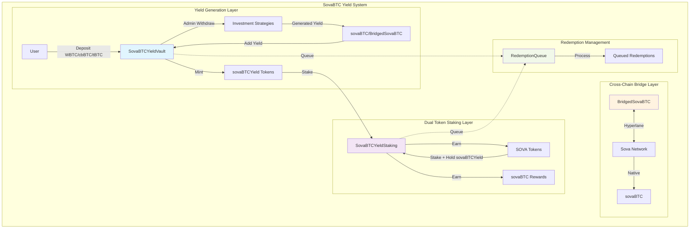
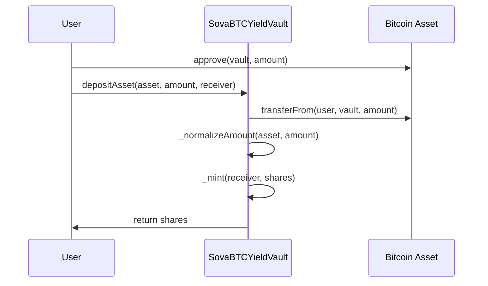
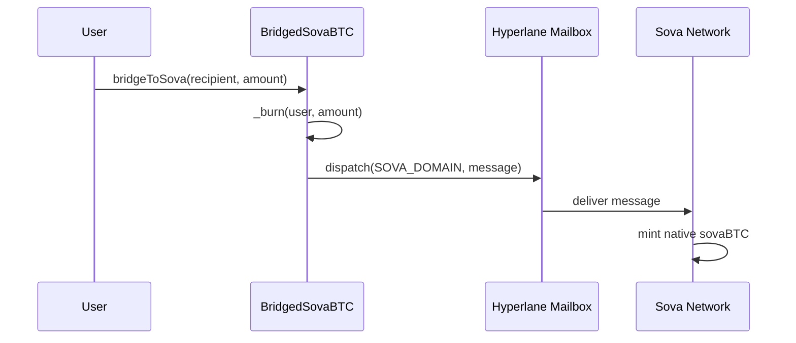
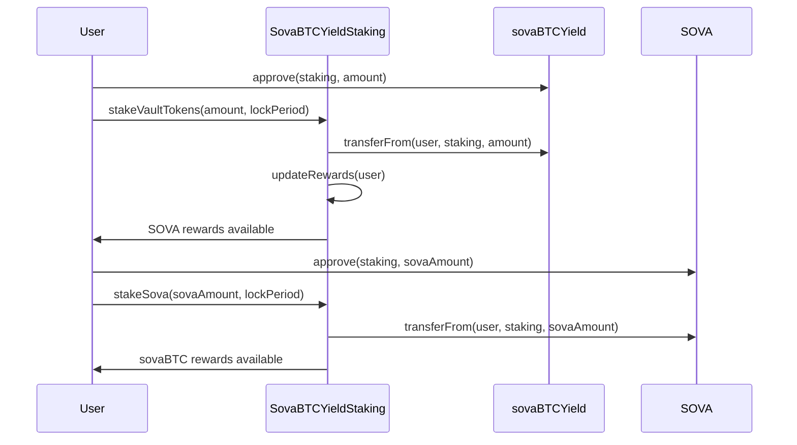
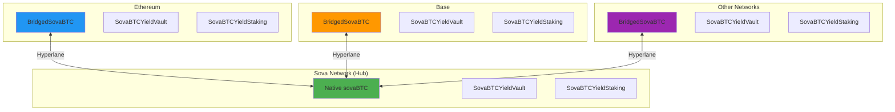
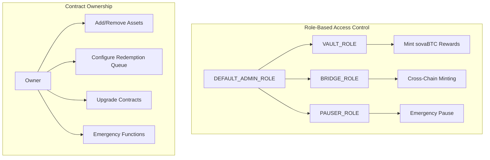

# SovaBTC Yield System Architecture

> **Last Updated:** July 29, 2025

This document provides a comprehensive overview of the SovaBTC Yield System architecture, including core contracts, data flows, and network interactions.

## Table of Contents

- [System Overview](#system-overview)
- [Architecture Diagram](#architecture-diagram)
- [Core Contracts](#core-contracts)
- [Data Flow](#data-flow)
- [Network Topology](#network-topology)
- [Security Architecture](#security-architecture)

## System Overview

The SovaBTC Yield System is a multi-chain Bitcoin yield generation platform that enables users to deposit various Bitcoin variants (WBTC, cbBTC, tBTC, native sovaBTC) into ERC-4626 compliant yield vaults and earn Bitcoin-denominated yields through professionally managed investment strategies.

### Core Components

1. **SovaBTCYieldVault**: ERC-4626 compliant vault accepting multiple Bitcoin variants
2. **BridgedSovaBTC**: Cross-chain sovaBTC token via Hyperlane protocol  
3. **SovaBTCYieldStaking**: Dual token staking system with symbiotic rewards
4. **RedemptionQueue**: Configurable queue system for managing redemptions

## Architecture Diagram



## Core Contracts

### 1. SovaBTCYieldVault.sol
**ERC-4626 Compliant Yield Vault**

Multi-asset Bitcoin yield generation vault with professional investment strategy integration.

**Key Features:**
- ERC-4626 standard compliance with multi-asset support
- Decimal normalization for 6, 8, and 18 decimal assets
- Dynamic exchange rate tracking yield accumulation
- Admin-controlled asset withdrawal for investment strategies
- Network-aware reward token integration
- Configurable redemption queue integration

**Critical Functions:**
```solidity
// Multi-asset deposit with automatic decimal normalization
function depositAsset(address asset, uint256 amount, address receiver) external returns (uint256 shares);

// Redeem vault shares for sovaBTC/BridgedSovaBTC rewards
function redeemForRewards(uint256 shares, address receiver) external returns (uint256 rewardAmount);

// Queue-based redemption for liquidity management
function requestQueuedRedemption(uint256 shares, address receiver) external returns (bytes32 requestId);

// Admin functions for investment strategy management
function adminWithdraw(address asset, uint256 amount, address destination) external onlyOwner;
function addYield(uint256 rewardAmount) external onlyOwner;
```

### 2. BridgedSovaBTC.sol
**Cross-Chain sovaBTC Token via Hyperlane**

Canonical sovaBTC representation on non-Sova networks using Hyperlane's burn-and-mint bridge pattern.

**Key Features:**
- ERC-20 with 8 decimals (matching native sovaBTC)
- Hyperlane integration for secure cross-chain messaging
- Role-based access control (BRIDGE_ROLE, VAULT_ROLE)
- Burn-and-mint bridge model for total supply consistency
- Hub-and-spoke architecture with Sova Network as hub

**Critical Functions:**
```solidity
// Bridge tokens from current chain to Sova Network
function bridgeToSova(address recipient, uint256 amount) external;

// Handle incoming cross-chain messages (called by Hyperlane Mailbox)
function handle(uint32 origin, bytes32 sender, bytes calldata body) external;

// Mint tokens for authorized roles (vault/bridge)
function mint(address to, uint256 amount) external;
```

### 3. SovaBTCYieldStaking.sol
**Dual Token Staking System**

Two-tier symbiotic staking system requiring both sovaBTCYield and SOVA tokens for maximum rewards.

**Key Features:**
- Level 1: Stake sovaBTCYield → Earn SOVA tokens
- Level 2: Stake SOVA + maintain sovaBTCYield stake → Earn sovaBTC
- Lock periods with reward multipliers (1.0x to 2.0x)
- Dual staking bonus (+20% for holding both tokens)
- Emergency unstaking with penalties
- Queue-based reward redemption

**Critical Functions:**
```solidity
// Stake vault tokens to earn SOVA
function stakeVaultTokens(uint256 amount, uint256 lockPeriod) external;

// Stake SOVA to earn sovaBTC (requires vault tokens staked)
function stakeSova(uint256 amount, uint256 lockPeriod) external;

// Queue-based reward redemption
function requestQueuedRewardRedemption(uint256 amount, address receiver) external returns (bytes32 requestId);

// Compound SOVA rewards back into stake
function compoundSovaRewards() external;
```

### 4. RedemptionQueue.sol
**Configurable Redemption Queue System**

Manages queued redemptions with configurable windows and liquidity management for both vault shares and staking rewards.

**Key Features:**
- Configurable redemption windows (24 hours default)
- Daily volume limits with queue management
- FIFO processing with batch operations
- Emergency controls and admin overrides
- Support for both vault and staking redemptions

**Critical Functions:**
```solidity
// Request redemption with queue management
function requestRedemption(address user, RedemptionType redemptionType, uint256 amount, address assetOut, uint256 estimatedOut) external returns (bytes32 requestId);

// Fulfill redemption requests
function fulfillRedemption(bytes32 requestId, uint256 actualAmountOut) external;

// Admin configuration
function updateQueueConfig(QueueConfig memory newConfig) external onlyOwner;
```

## Data Flow

### 1. Deposit Flow


### 2. Cross-Chain Bridge Flow


### 3. Staking Flow


## Network Topology

### Hub-and-Spoke Architecture

The system employs a hub-and-spoke model with Sova Network as the central hub:



### Supported Assets by Network

| Network | Primary Assets | Cross-Network Assets | Bridge Token |
|---------|---------------|---------------------|--------------|
| **Ethereum** | WBTC, cbBTC, tBTC | BridgedSovaBTC from Base, Others | BridgedSovaBTC |
| **Base** | cbBTC, tBTC | BridgedSovaBTC from Ethereum, Others | BridgedSovaBTC |
| **Sova Network** | Native sovaBTC | BridgedSovaBTC from All Networks | Native sovaBTC |

## Security Architecture

### Access Control Model



### Security Features

1. **Multi-Signature Ownership**: All admin functions should use multi-sig wallets in production
2. **Role-Based Access**: Granular permissions for different operations
3. **Pausability**: Emergency pause functionality across all contracts
4. **Upgradeability**: UUPS proxy pattern for contract upgrades
5. **Reentrancy Protection**: Guards on all external functions
6. **Queue-Based Redemptions**: Prevents liquidity drain attacks

### Hyperlane Security Model

1. **Mailbox Validation**: Only configured Hyperlane Mailbox can call `handle()`
2. **Message Authentication**: Hyperlane's cryptographic validation ensures message integrity
3. **Domain Isolation**: Hardcoded domain IDs prevent cross-chain confusion
4. **Burn-and-Mint Consistency**: Total supply maintained across all chains

## Deployment Architecture

### Multi-Stage Deployment Process

The system uses a multi-stage deployment process to resolve cross-network dependencies:

1. **Stage 1**: Deploy core contracts on each network independently
2. **Stage 2**: Configure cross-network asset support after all deployments
3. **Stage 3**: Verification and testing

See [Deployment Orchestration Guide](./deployment-orchestration.md) for detailed deployment procedures.

## Integration Points

### ERC-4626 Compliance

The vault implements full ERC-4626 compatibility, enabling integration with:
- DeFi protocols and yield aggregators
- Portfolio management tools
- Automated market makers
- Lending and borrowing protocols

### Cross-Chain Interoperability

Through Hyperlane integration:
- Seamless sovaBTC transfers between networks
- Unified liquidity across multiple chains
- Hub-and-spoke architecture for optimal capital efficiency

## Performance Considerations

### Gas Optimization

- 8-decimal precision for Bitcoin assets reduces gas costs
- Batch redemption processing for efficiency
- Optimized storage layouts in upgradeable contracts

### Scalability

- Multi-network deployment distributes load
- Queue-based redemptions manage peak demand
- Configurable parameters for different network conditions

## Monitoring and Analytics

### Key Metrics

1. **Total Value Locked (TVL)** across all networks
2. **Cross-chain bridge volume** and consistency
3. **Redemption queue status** and processing times
4. **Staking participation rates** and reward distribution
5. **Asset utilization ratios** for yield strategies

### Health Indicators

- Contract pause status across networks
- Queue processing delays and volume limits
- Cross-chain message delivery success rates
- Reward token availability for distributions

For implementation details and integration examples, see the [Integration Guide](./integration.md).